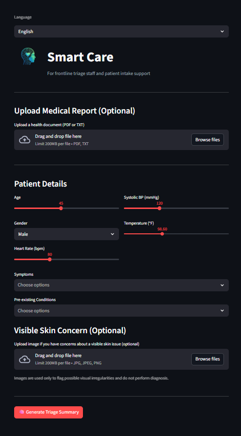

# Smart Care

Smart Care is a patient triage and care prioritization system designed to support frontline healthcare intake decisions.

This project was developed as part of the **Kanini Hackathon (Chennai)**.

**Live Demo:** [smart-care-triage.streamlit.app](https://smart-care-triage.streamlit.app/)


---

## 🩺 What Smart Care Does

Smart Care provides **decision-support** for patient triage by:
- Categorizing patients into **Low / Medium / High risk**
- Recommending an appropriate **care level** (OPD / Ward / ICU)
- Suggesting relevant **clinical departments or specialties**
- Highlighting **key contributing factors**
- Escalating conservatively when confidence is low

> ⚠️ This system does **not** provide diagnosis, treatment, or bed allocation.

---

## 🔍 Key Features

- Structured patient intake (age, vitals, symptoms)
- Optional EHR / medical report ingestion (PDF / TXT)
- Optional visual flagging for skin-related concerns
- Explainable, interpretable risk stratification
- Interactive **Data Analytics Dashboard** (EDA, model evaluation, benchmarking)
- Multilingual interface (English, Hindi, Tamil)
- Safety-first scope boundaries

---

## 🧠 System Flow

→ Patient Inputs  
→ Feature Encoding  
→ Risk Stratification  
→ Confidence & Safety Checks  
→ Care-Level & Department Routing  
→ Explainable Triage Output

---

## 🧰 Technology Stack

- **Frontend:** Streamlit (Python)
- **Risk Stratification Model:** AdaBoost (scikit-learn), benchmarked against 12+ models
- **Analytics:** Plotly dashboards, confusion matrix, feature importance
- **Data:** Synthetic patient dataset (500 records)
- **Supporting Libraries:** Pandas, NumPy, scikit-learn, XGBoost, LightGBM, Plotly, OpenCV
- **Language:** Python 3

Technology choices prioritize **explainability, safety, and rapid deployment**.

---

## ▶️ How to Run Locally

### 1. Install dependencies
```bash
pip install -r requirements.txt
```

### 2. Run the application
```bash
streamlit run app.py
```

---

## 📌 Safety & Ethics

- No disease diagnosis
- No treatment recommendations
- No clinical decision replacement
- Synthetic data only (privacy-safe)
- Intended for triage support, not final decisions

---

## 🚀 Future Scope

- Temporal re-evaluation of patient status
- Queue-level triage simulation
- Audio-based intake signals (e.g., cough patterns)

---

## 👤 Author

Developed by **Vidhan Gupta**
Kanini Hackathon Submission
